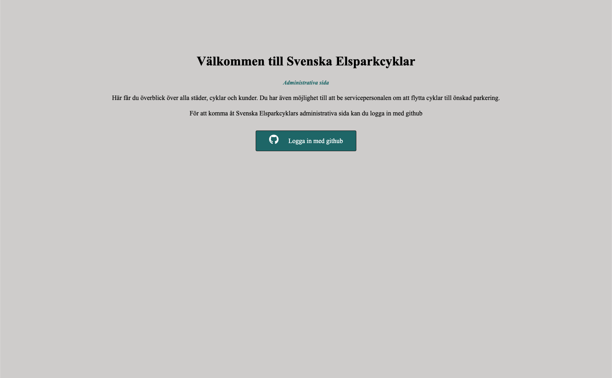
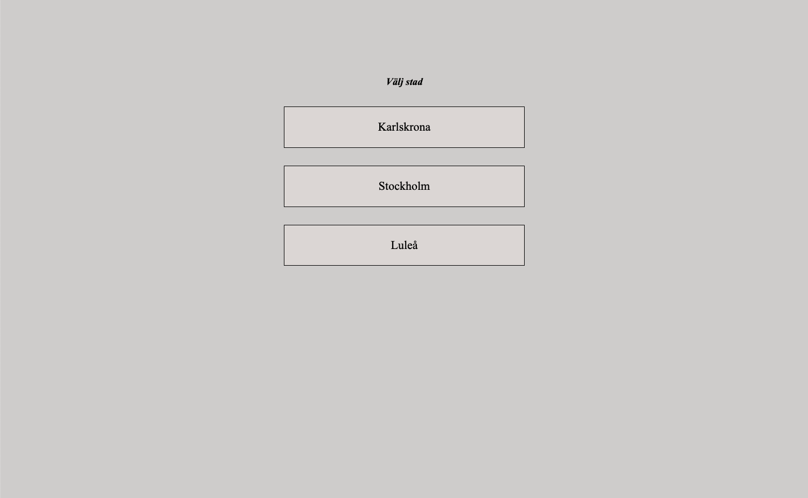
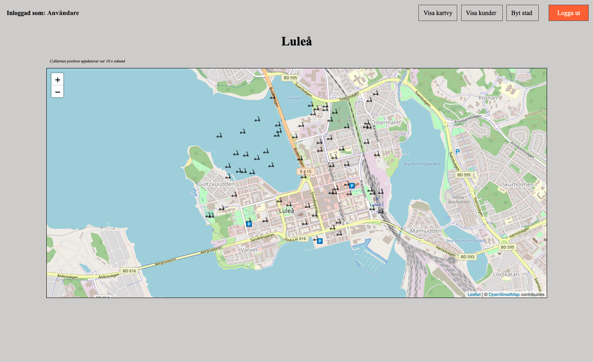
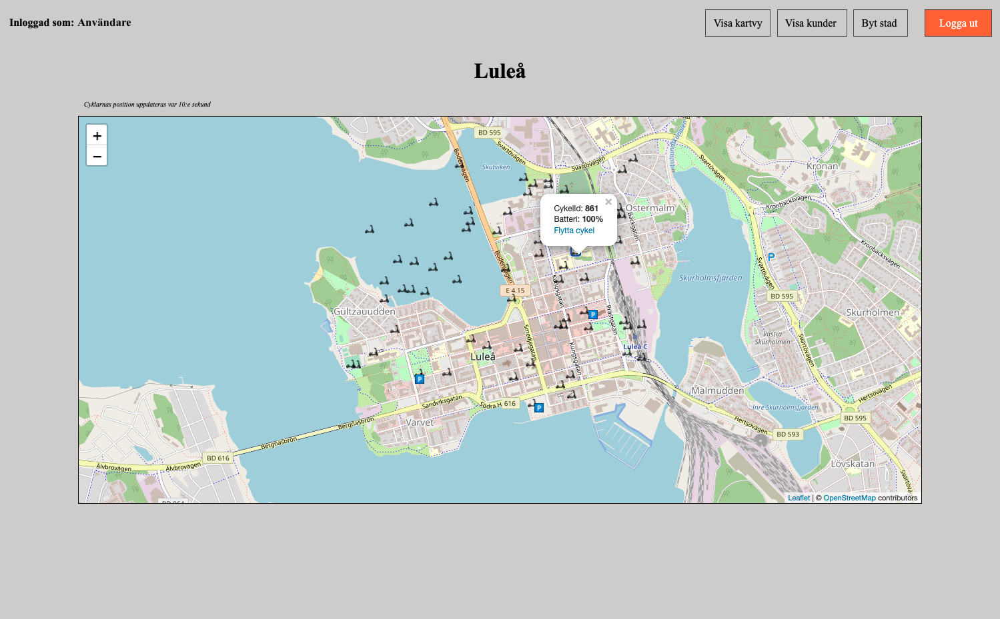
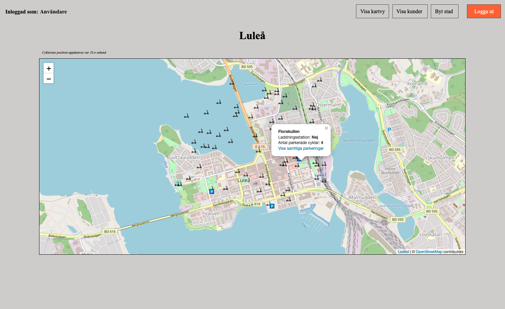
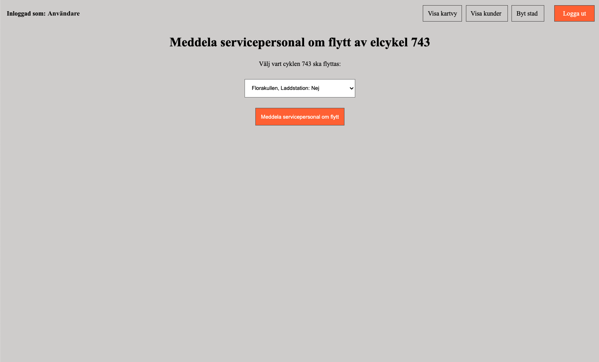
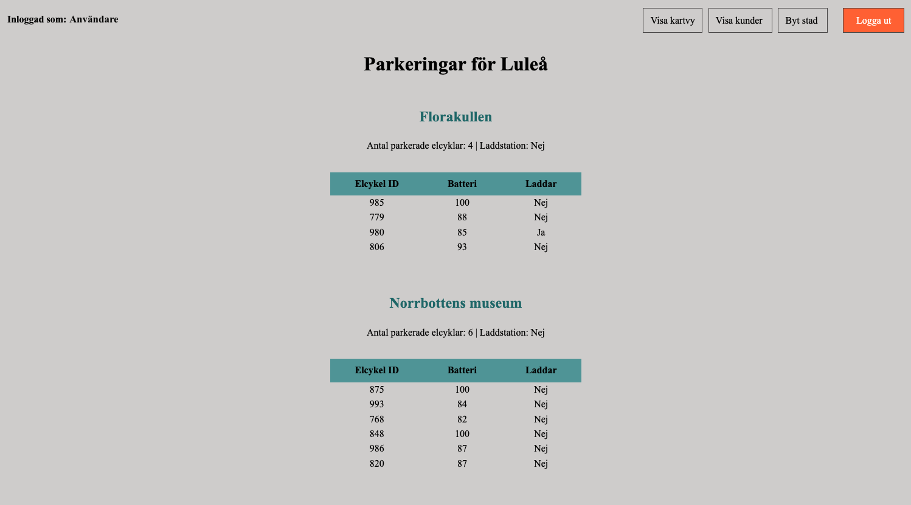
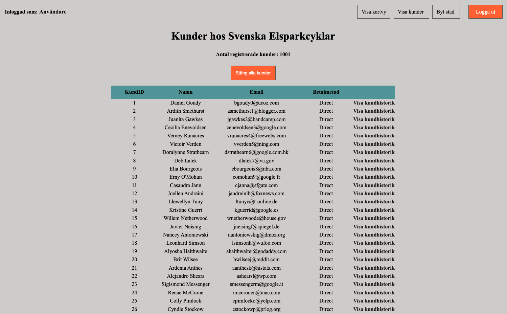

# Administrative webpage 'Svenska Elsparkcyklar AB'
A part of the project 'Svenska Elsparkcyklar AB' in course 'Webbaserade ramverk och designmönster' at BTH. 

## Welcome page
  
This is the landing page for the Administration, here you have the possibility to sign in with GitHub authentication.

## After authentication
  
Once you signed in you can choose city.

## Map for cities
  
Here's the map over the city and its scooters and parking spaces, you can choose which scooter you want to move or show each parking space by clicking the icons in the map.

## Scooters position in map

## Parking spaces in map

## Transport for Scooter
 
Once you choosen which scooter you want to move, you choose parking space and let the maintaince do its job. 

## List of parking spaces
  
Here's the list over parking spaces and the current scooters parked. You can also se status for batteri and if the scooter is loading.

## Page of customers
  
For the customerpage, you can track each customer and see the previous history for each customer.